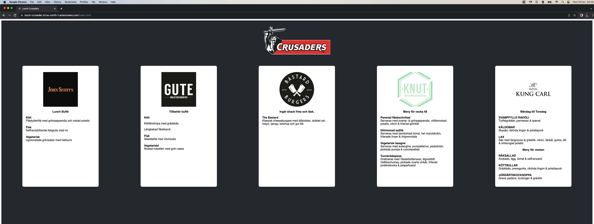

# Introduction

This webpage provides restaurant information regarding their lunch offerings for the day. The target audience is people at current working office, Kungsgatan 2 in Stockholm.

Supported restaurants include:
* Bastard Burgers - Folkungagatan 122
* Gute - Brunnsgatan 6
* JohnScotts - Kungsgatan 37
* Knut - Regeringsgatan 77
* Kung Carl - Birger Jarlsgatan 21


This site is not monetized and is solely used to consolidate information in one place.



[https://lunch-crusader.s3.eu-north-1.amazonaws.com/index.html](https://lunch-crusader.s3.eu-north-1.amazonaws.com/index.html)

# AWS deployment

## Create Lambda Functions
* Zip the entier folder
* Add the zip into an s3 bucket
* In `template.yaml`, add the resource following this template

```yaml
  <name>Function:
    Type: AWS::Serverless::Function
    Properties:
      CodeUri: s3://<bucket>/<zip-file>
      Handler: index.handler
      Events:
        GetGute:
          Type: Api
          Properties:
            Path: /<endpoint>
            Method: get
```

### Single lambda function deployment
* Replace the current zip file with the new one.
* Go to the Lambda page, choose your lambda, navigate to the code tab, select "Upload from" -> "Amazon S3 Location," and pick the new zip file.
* Note: After a new deployment, update the web endpoint to match the new endpoint.

## Webb deployment
* Replace the contents inside the lunch-crusader S3 bucket.
* Run `npm run build` within the Webb directory.
* Place the files and folders inside the S3 bucket.

### Run script in CloudShell

* Nano `lunch-api.yaml`
  * paste your file + save and close
* Execute: `aws cloudformation deploy --template-file lunch-api.yaml --stack-name LunchStack --region eu-north-1 --capabilities CAPABILITY_IAM`

# Additional things in AWS

## Create a cache in API gateway
Lambda often experiences cold starts. Adding a cache can assist when multiple people access the information simultaneously. This page is likely to be requested around 11-12. I've added a cache for 900 seconds (15 min) with a minimum cache of 0.5 GB. Throttling has been set to handle attacks: 1 request per second and 10 burst requests. With the cache, security is enhanced.

## Cloudfront cache
In CloudFront, I've implemented cache settings for the page to further enhance speed. These changes are free of charge.

# Testing
To create a new lambda and test it, you can:

* Create it in the Server directory.
* Create a fetcher in Webb.
